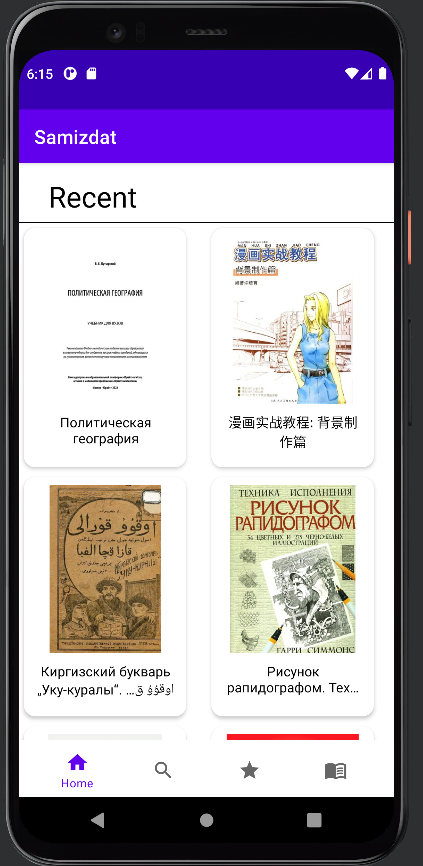
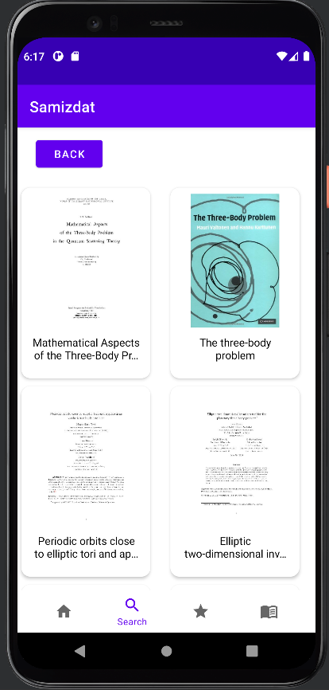
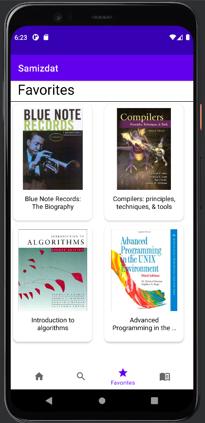
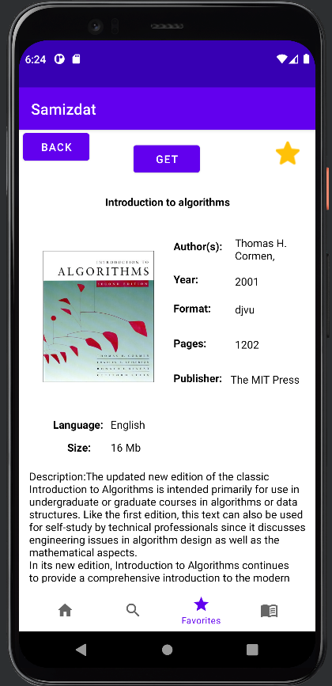

<h1 align="center"><b>Samizdat</b></h1>

<h3 align="center">An Android app for downloading books for free.</h3>

<h4 align="center" style="text-align: center; margin-top: 20px" >⚠️ This is just an implimetation for an open source libgen app checkout <a href="https://github.com/prince-ao/Aurora">Aurora</a></h4>

## Screenshots

## Features

- Recents page
- Searching
- Save Books locally
- Download Books

## Technologies used

- frontend
  - Kotlin
  - Retrofit
- backend
  - typescript
  - express js
